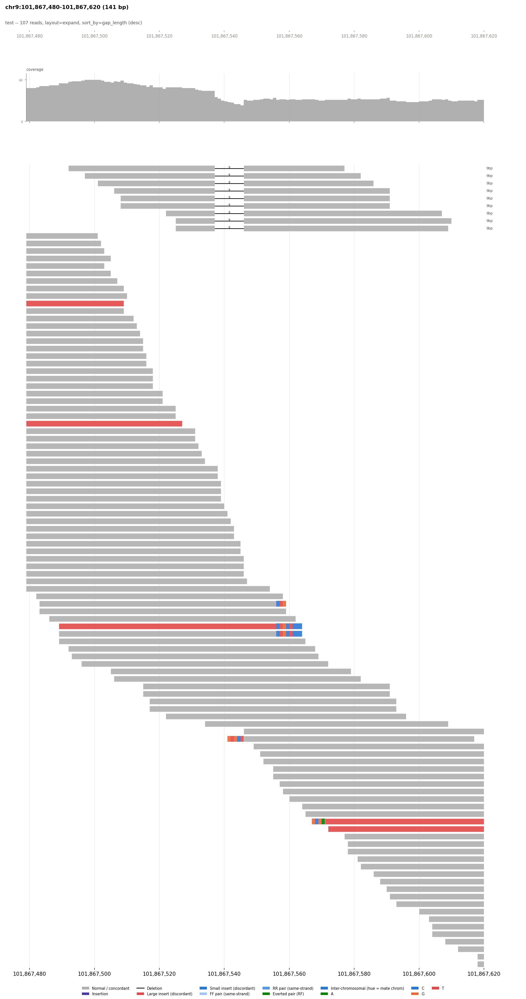

# simple_bam_snap

`simple_bam_snap` creates IGV-like PNG snapshots directly from indexed BAM
files. It renders structured CIGAR and SA-tag data with
[pysam](https://pysam.readthedocs.io/), so insertions, deletions, skipped
regions, soft clips, mismatches, and split alignments retain their genomic
geometry.

It is especially useful for reviewing structural-variant evidence:

- pack reads into a compact IGV-style track, or expand and rank one read per row;
- sort reads by the nucleotide carried at an SNV locus, prioritising alternative alleles;
- optionally draw an IGV-like vertical guide through the center of each locus;
- collapse, expand, or squish alignment tracks for the required visual density;
- automatically downsample alignment tracks above 100× depth;
- colour SNV allele fractions above 20% within the coverage track;
- show the current window in red on a chromosome-length overview;
- highlight discordant pair orientation and insert-size categories;
- place visible mates on one row and link them with IGV-style pair connectors;
- colour, split, and filter alignments by haplotype and phase-set tags;
- show a primary locus beside an automatically selected mate locus;
- add indexed or plain BED, GFF, GTF, VCF, SEG, and log2/bedGraph tracks;
- select annotated primary gene isoforms with safe per-gene fallback;
- combine copy-number tracks with genotype-derived BAF/LOH views;
- compare two BAMs over the same locus;
- export the computed per-read metrics to TSV;
- configure behaviour, all plot palettes, track colours, and visual styles with YAML.

## Installation

```bash
git clone https://github.com/GENCARDIO/simple_bam_snap.git
cd simple_bam_snap
pip3 install -r requirements.txt
```

The BAM must be indexed. A reference FASTA is optional; when supplied with
`--fasta`, it enables mismatch colouring and a base-level reference track for
small windows. A missing FASTA index is created automatically when possible.

## Quick start

```bash
python3 simple_bam_snap.py \
  --bam sample.bam \
  --region chr9:101867492-101867612 \
  --fasta reference.fasta \
  --layout expand \
  --sort_by gap_length \
  --output_dir out \
  --output_name snapshot
```

Regions use 1-based inclusive coordinates. `--flank` adds context to both
sides before rendering.

## Chromosome overview

Each locus has a UCSC-style cytoband ideogram above its coverage track. Its
rectangular chromosome bar spans the exact width of the genomic plot, including
comparison and mate panels, and marks the current window in red.
Giemsa stains, chromosome bands, and the red centromere come from the official
UCSC `cytoBand` tables. Paired p/q `acen` bands shape two chromosome arms that
taper into a finite-width centromeric bridge instead of two arrowheads touching
at a point. The red vertical marker shows the current window at its proportional
chromosome position. Very short windows retain a minimum visible marker width.

Official hg19 and hg38 tables are bundled. The default `--genome auto` selects
one only when chromosome lengths in the BAM header match that assembly exactly;
it does not guess from `chr` naming. Select explicitly with `--genome hg19` or
`--genome hg38`. For another assembly, pass a plain or gzip-compressed UCSC
five-column table:

```bash
python3 simple_bam_snap.py \
  --bam sample.bam \
  --region chr9:101867492-101867612 \
  --cytoband_file myAssembly.cytoBand.txt.gz
```

`--cytoband_file` overrides `--genome`. If auto-detection cannot identify an
assembly, the tool retains the neutral chromosome outline. `--genome none`
also requests that neutral outline, while `--no_ideogram` hides the entire
track. Mate view draws one ideogram for each locus; comparison mode shares one
because both BAMs use the same window.

The bundled files are the UCSC
[hg19](https://hgdownload.soe.ucsc.edu/goldenPath/hg19/database/cytoBand.txt.gz)
and [hg38](https://hgdownload.soe.ucsc.edu/goldenPath/hg38/database/cytoBand.txt.gz)
database tables.

## Reference bases

Supply an indexed or indexable FASTA with `--fasta`. Windows of at most 250 bp
then include an IGV-like reference row with one lightly colour-coded cell per
base (A green, C blue, G orange, T red). Base letters appear when the physical
figure width provides enough room to read them.

```bash
python3 simple_bam_snap.py \
  --bam sample.bam \
  --fasta reference.fa \
  --region chr1:100001-100140 \
  --output_name base-detail
```

Change the threshold with `--max_reference_span BP`. Setting it to `0` hides
the reference row while retaining FASTA-backed mismatch detection. Large
windows omit the row automatically, avoiding expensive per-base drawing.

## SNV allele fractions in coverage

When `--fasta` is supplied, the grey coverage bars include IGV-style coloured
segments for observed SNV alleles. A, C, G, and T use the same colours as the
reference and mismatch tracks. An allele is shown only when its count divided
by the full depth at that position is greater than 0.20 by default:

```bash
python3 simple_bam_snap.py \
  --bam sample.bam \
  --fasta reference.fa \
  --region chr1:100001-100140 \
  --coverage_vaf_threshold 0.10 \
  --min_baseq 20 \
  --min_variant_mapq 20 \
  --show_variant_counts
```

By default, the denominator uses all A/C/G/T observations from retained input
alignments, even when the displayed alignment rows are downsampled. Set
`--min_baseq` and `--min_variant_mapq` to filter both the SNV numerator and its
nucleotide-depth denominator without changing the grey total-coverage bars.
`--show_variant_counts` adds compact labels containing ALT/depth, VAF,
forward/reverse counts, mean base quality, and mean MAPQ. Labels are omitted
automatically when the physical base spacing is too narrow to keep them
readable.

Only reference-backed single-nucleotide mismatches are included; insertions
and deletions keep their existing alignment-track markers. Set
`--coverage_vaf_threshold 1` to suppress all SNV colouring without hiding
coverage.

## View alignments as pairs

Use `--view_as_pairs` to place two visible primary mates on the same row and
draw a connector across the genomic interval between them, as in IGV:

```bash
python3 simple_bam_snap.py \
  --bam sample.bam \
  --region chr9:101867481-101867620 \
  --view_as_pairs \
  --layout pack \
  --display_mode squish \
  --output_name paired-alignments
```

The complete pair is treated as one layout unit, so another alignment cannot
be packed into the space between its mates. Pair-category colour also applies
to the connector. Primary mates are linked only when both are visible on the
same chromosome; off-window, inter-chromosomal, supplementary, and unpaired
records remain normal single alignments. Downsampling removes incomplete
visible pairs instead of leaving misleading orphan connectors.

## Haplotype-aware alignments

Standard `HP` and `PS` BAM tags can drive alignment colouring and grouping:

```bash
python3 simple_bam_snap.py \
  --bam phased.bam \
  --fasta reference.fa \
  --region chr1:100001-100500 \
  --haplotype_view split \
  --display_mode collapse \
  --output_name phased-locus
```

`--haplotype_view color` keeps the selected layout but colours read bodies by
HP. `--haplotype_view split` additionally gives every HP value a distinct
lane; even collapsed display retains one row per haplotype. HP1 is blue, HP2
is orange, additional values use a stable palette, and reads without HP are
shown explicitly in grey. Split-lane labels include a single PS identifier or
the number of phase sets represented in that lane.

Haplotype colour takes precedence over discordant-pair body colour while this
view is active, and the legend replaces **Pair evidence** with a **Haplotype**
compartment. Insertions, deletions, mismatches, soft clips, mate links, MAPQ
shading, and variant evidence remain visible.

Filter the BAM-derived alignments and coverage to selected values with:

```bash
--haplotype_filter 1 2
--haplotype_filter 1 untagged
```

The default tags can be replaced with `--haplotype_tag TAG` and
`--phase_set_tag TAG`; both must be valid two-character SAM tags. HP and PS are
also written to `--metrics_tsv`. Haplotype mode works in ordinary, comparison,
paired-read, and two-locus mate views.

Example: [`out/19_haplotype_split_view.png`](out/19_haplotype_split_view.png).

## Mate view

Mate view places the requested region on the left and an inferred partner
locus on the right. This is useful for discordant pairs that support
translocations or other rearrangements.

```bash
python3 simple_bam_snap.py \
  --bam tumor.bam \
  --region chr3:187721000-187721500 \
  --mate_view \
  --mate_window_source discordant \
  --only discordant \
  --output_dir out \
  --output_name translocation
```

Select the evidence used to infer the right-hand locus with
`--mate_window_source`:

| Source | Candidate coordinates |
|---|---|
| `discordant` (default) | mapped mate positions of reads classified as discordant |
| `split` | centres of supplementary alignments in SA tags |
| `softclip` | mapped mate positions of reads with at least `--min_softclip` clipped bases |

Candidates are grouped by chromosome because coordinates from different
chromosomes cannot be averaged. The chromosome with the most candidates is
selected (chromosome name breaks a tie), and the mate panel is centred on the
mean candidate coordinate for that chromosome. Its default span matches the
primary region after `--flank`; override it with `--mate_window_size BP`.
Windows are clamped to BAM contig boundaries.

The `softclip` source uses the known mapped mates of soft-clipped reads. It
does not align clipped sequence to infer a new locus. If the requested source
has no usable candidates, the command exits with an explanatory error.
When `--only` is active, the exact supporting read names are retained in the
mate panel even if the mate-side cohort would classify them differently.

Mate view currently accepts one BAM and therefore cannot be combined with
`--bam2`.

## YAML configuration

Pass a YAML file with `--config` to set reusable behaviour and appearance
defaults without editing Python. Every section and key is optional. Explicit
command-line arguments take precedence over values in `preferences`.

```yaml
preferences:
  display_mode: squish
  max_alignment_depth: 150
  primary_isoforms: prefer
  view_as_pairs: true
  fig_width: 16

alignment_colors:
  normal: "#c8c8c8"
  large_insert: "#d73027"
  small_insert: "#4a3aa7"
  ff: "#91bfdb"
  rr: "#74add1"
  everted: "#1a9850"
  interchrom: "#984ea3"

track_colors:
  bed: "#000000"
  gene: "#17217a"
  vcf: "#7a1f5c"

styles:
  row_height_in: 0.24
  annotation_row_height_in: 0.32
  alignment_alpha: 0.90
```

```bash
python3 simple_bam_snap.py \
  --bam sample.bam \
  --region chr9:101867492-101867612 \
  --config config.example.yaml \
  --output_name custom-colours
```

The partial theme in [`out/demo_colors.yaml`](out/demo_colors.yaml) produces
[`out/21_yaml_configuration.png`](out/21_yaml_configuration.png), including
YAML-selected squish mode, row limit, collapsed genes, palette, opacity, and
line styling.

The available sections are:

| Section | Controls |
| --- | --- |
| `preferences` | CLI defaults such as layouts, filters, downsampling, mate/haplotype views, isoform selection, figure size, and DPI |
| `alignment_colors` | normal reads and discordant-pair categories; the small-insert colour also colours CIGAR insertions |
| `base_colors` | A/C/G/T/N in reads, coverage, and the reference row |
| `track_colors` | default BED, GFF/GTF, VCF, CNV, and BAF colours |
| `visual_colors` | deletions, skips, soft clips, coverage, grid, center guide, text, legend, ideogram, centromere, and CNV gain/loss |
| `haplotype_colors` | HP 1, HP 2, and untagged reads |
| `cytoband_colors` | UCSC stain colours |
| `chromosome_palette` | fallback hues for chromosomes and additional haplotypes |
| `styles` | row/track heights, margins, opacity, principal line widths, and center-guide dash style |

See [`config.example.yaml`](config.example.yaml) for the complete schema and
built-in values. Setting `alignment_colors.interchrom: null` preserves stable
chromosome-specific mate hues. Custom colours accept hex values and Matplotlib
colour names. Unknown keys, invalid colours, invalid alpha values, and invalid
CLI preference choices are rejected early.

Preference names normally match the long CLI option. Positive YAML aliases are
provided for `show_coverage`, `show_ideogram`, `pair_colors`, `mapq_shading`,
`annotate_gap`, and `include_supplementary`, avoiding double-negative settings
such as `no_coverage: false`.

## Genomic and quantitative tracks

Add BED, GFF/GFF3, GTF, VCF, SEG, bedGraph, or log2/CNV data with repeatable
`--track` arguments. Labels are optional and correspond to tracks in the same
order:

```bash
python3 simple_bam_snap.py \
  --bam sample.bam \
  --region chr9:101867492-101867612 \
  --track genes.gtf.gz \
  --track variants.bed \
  --track_label "GENCODE genes" \
  --track_label "Candidate variants" \
  --output_name annotated
```

Gene tracks support three independent layouts through
`--track_display {collapse,pack,expand}`:

- `collapse` merges transcript isoforms into gene-level exon/UTR models;
- `pack` preserves transcripts and shares rows between non-overlapping models;
- `expand` gives every transcript its own row and displays its transcript name
  or ID.

Primary-transcript selection is independent of that layout:

| `--primary_isoforms` | Behaviour |
|---|---|
| `all` (default) | retain every transcript and mark recognized primary models with `★` |
| `prefer` | choose the best annotated primary tier per gene; retain all isoforms for genes without a marker |
| `only` | retain marked primary isoforms and remove genes without any recognized marker |

Detection covers common GFF3/GTF representations of MANE Select, Ensembl
canonical, APPRIS principal, `transcript_is_canonical`, and generic
canonical/primary-transcript flags. If several marker types occur for one
gene, the priority is MANE Select, Ensembl canonical, APPRIS principal, then a
generic primary flag. All transcripts tied at the best available tier are
retained. Selection happens before `collapse`, so a collapsed gene model is
built only from its selected isoform where a primary annotation exists.

```bash
python3 simple_bam_snap.py \
  --bam sample.bam \
  --region chr9:101867492-101867612 \
  --track genes.gtf.gz \
  --track_display expand \
  --primary_isoforms prefer \
  --output_name primary-isoforms
```

Example: [`out/20_primary_isoform_selection.png`](out/20_primary_isoform_selection.png).

The selected mode is the default for all annotation tracks. For a
self-contained track definition, repeat
`--custom_track FILE TYPE NAME COLOR [DISPLAY]`; the optional fifth value
overrides the default for that track. `TYPE` may be `bed`, `gff`, `gff3`, `gtf`,
`vcf`, `seg`, `bedgraph`, `log2`, `cnv`, or `auto`; an explicit type also
permits a non-standard file extension. Colours accept quoted hex, `R,G,B`, or
`rgb(R,G,B)` values:

```bash
python3 simple_bam_snap.py \
  --bam sample.bam \
  --region chr9:101867492-101867612 \
  --track_display pack \
  --custom_track variants.data bed "Candidate variants" "#000000" collapse \
  --custom_track genes.gtf.gz gtf "GENCODE genes" "rgb(23,33,122)" expand \
  --output_name custom-tracks
```

Quote hex colours because an unquoted `#` starts a shell comment. Custom-track
definitions can be combined with the shorter `--track`/`--track_label`
interface. Track order follows the ordinary tracks first and then custom
tracks, each in command-line order.

Plain-text tracks are scanned directly. Files ending in `.gz`, `.bgz`, or
`.bgzf` must be block-gzipped and have a tabix `.tbi` or `.csi` index next to
the data file. This applies equally to `--track` and `--custom_track`. BGZF and
its index are validated when the command starts; each requested window is then
read with `pysam.TabixFile.fetch()`, without scanning the complete compressed
track. For example:

```bash
bgzip genes.gtf
tabix -p gff genes.gtf.gz

bgzip regions.bed
tabix -p bed regions.bed.gz

bgzip variants.vcf
tabix -p vcf variants.vcf.gz

bgzip tumour.seg
tabix -S 1 -s 2 -b 3 -e 4 tumour.seg.gz

bgzip bins.bedgraph
tabix -p bed bins.bedgraph.gz
```

BED3/6 intervals are drawn as black rectangles by default. BED12 records use
black exon blocks and thick coding bounds. GFF and GTF features are grouped by transcript and
rendered in a UCSC-like deep-navy style: fine intron connector lines with
repeated strand-direction arrows, thick coding or exon rectangles, thinner
explicit or inferred UTR rectangles, and transcript labels. Overlapping models
are packed onto separate rows.

VCF records use their one-based `POS` correctly and are drawn as zero-based
genomic intervals in a dark burgundy track. Reference allele length determines
the default span; `INFO/END` extends symbolic and structural variants. The VCF
ID is used as the label, falling back to `REF>ALT` when ID is `.`. Plain VCF is
supported directly, while `.vcf.gz` must be BGZF-compressed and have a tabix
`.tbi` or `.csi` index.

SEG files are rendered as quantitative copy-number tracks around a labelled
zero baseline. Standard columns such as `Sample`, `Chromosome`, `Start`, `End`,
`Num_Probes`, and `Segment_Mean` are detected case-insensitively. SEG and
SEG-like `.cnv` coordinates are interpreted as one-based inclusive. Headerless
six-column IGV/GISTIC-style rows are also accepted. Gains use red and losses
use blue by default; passing a colour through `--custom_track` draws both signs
with that chosen colour.

bedGraph, `.bdg`, and `.log2` files use four columns—chromosome, start, end,
and log2 value—with zero-based half-open intervals. Both binned log2 ratios and
long segmented intervals are shown as horizontal values with translucent fill
to zero. CNV tracks retain a symmetric numeric log2 scale and do not use
`--track_display` row packing.

```bash
python3 simple_bam_snap.py \
  --bam sample.bam \
  --region chr9:101000000-102000000 \
  --track tumour.seg \
  --track_label "Tumour copy number" \
  --custom_track normal.log2 bedgraph "Normal log2" "#555555" \
  --output_name copy-number
```

See [`out/17_cnv_seg_track.png`](out/17_cnv_seg_track.png) for a rendered SEG
example containing losses, near-neutral segments, and gains.

### BAF and LOH

Use `--baf_vcf` to add a zero-to-one B-allele-fraction track beside CNV data.
The selected VCF sample must contain heterozygous biallelic SNVs. BAF is
calculated from `FORMAT/AD` as `ALT / (REF + ALT)`, with `FORMAT/AF` used when
AD is unavailable. Homozygous calls, indels, multiallelic records, missing
depths, and non-finite values are omitted. The dashed 0.5 line makes balanced
heterozygous loci visible; displacement toward 0 or 1 reveals allelic
imbalance and LOH patterns.

```bash
python3 simple_bam_snap.py \
  --bam tumour.bam \
  --region chr9:101000000-102000000 \
  --track tumour.seg \
  --track_label "Tumour CNV" \
  --baf_vcf germline-snps.vcf.gz \
  --baf_sample Tumour \
  --baf_track_label "Tumour BAF / LOH" \
  --output_name cnv-baf
```

Plain VCF files are supported. BGZF-compressed VCF and BCF inputs require a
`.tbi` or `.csi` index. With multiple `--baf_vcf` arguments, repeat
`--baf_sample` and `--baf_track_label` in the same order. If no sample is
specified, the first VCF sample is selected.

The combined evidence example is
[`out/18_variant_evidence_baf_loh.png`](out/18_variant_evidence_baf_loh.png).

Tracks appear once above stacked BAM comparisons. Mate view fetches and draws
the same track sources independently for the primary and inferred mate loci.
`chr1`/`1` naming differences are resolved for indexed tracks when possible.

## Display modes and high-depth regions

Use `--display_mode` to control the visual density of every alignment panel:

| Mode | Behaviour |
|---|---|
| `collapse` | overlay all displayed alignments in one row |
| `expand` (default) | draw normal-height rows |
| `squish` | draw the same rows at a compact height |

The display mode is separate from `--layout`. For `expand` and `squish`,
`--layout pack` shares rows between non-overlapping reads, while
`--layout expand` assigns one alignment to each row for ranking. `collapse`
always uses one overlaid row, so the layout choice has no visible effect.

```bash
python3 simple_bam_snap.py \
  --bam deep.bam \
  --region chr1:100000-101000 \
  --display_mode squish \
  --layout pack \
  --output_name deep-region
```

Alignment tracks are downsampled automatically when more than 100 alignment
spans overlap. Change the cap with `--max_alignment_depth N`, or set it to `0`
to disable downsampling. Selection is deterministic and prioritises mate-view
supporters, discordant/gapped/split/soft-clipped evidence, and higher-MAPQ
reads. Coverage tracks, summary statistics, and metrics TSV files always use
the complete filtered read set. Images report how many alignments were
downsampled.

### Center guide

Pass `--center_guide` to draw a vertical dashed guide at the exact midpoint of
the displayed genomic window. It is hidden by default and spans reference,
annotation, coverage, and alignment tracks without crossing the ideogram or
legend. Stacked comparisons share the same midpoint, while each mate-view
locus receives its own centered guide.

```bash
python3 simple_bam_snap.py \
  --bam sample.bam \
  --region chr9:101867481-101867620 \
  --center_guide \
  --output_name centered-guide
```

Configure it through `preferences.center_guide`,
`visual_colors.center_guide`, and the `center_guide_alpha`,
`center_guide_width`, and `center_guide_line_style` style keys. See
[`out/23_center_guide.png`](out/23_center_guide.png) for the rendered example.

## Layout, sorting, and filtering

`--layout pack` greedily places non-overlapping reads or pair units on the same
row for a compact track. `--layout expand` uses one alignment—or one linked
pair when `--view_as_pairs` is active—per row and is best when ranking evidence
with `--sort_by`.

The default sort metric is `gap_length`:

```text
gap_length = max(cigar_gap, sa_gap)
```

`cigar_gap` is the total inserted/deleted length in the read's CIGAR. `sa_gap`
is the genomic distance to the closest same-chromosome supplementary
alignment in its SA tag. Combining them ranks an event consistently whether
an aligner represents it as one gapped CIGAR or as split alignments.

### Sort by nucleotide at an SNV

Use `--sort_by base` to group reads by the nucleotide they carry at one
genomic position. Supply that position as a 1-based coordinate with
`--sort_base_position`; when omitted, the midpoint of the requested window is
used. Non-reference A/C/G/T alleles sort before the reference allele, followed
by deletions, reference skips, and reads that do not cover the locus.
Alternative-allele reads are also protected preferentially during depth
downsampling. The FASTA base defines the reference allele when `--fasta` is
available; otherwise the most frequent observed nucleotide is used as a
local consensus.

```bash
python3 simple_bam_snap.py \
  --bam sample.bam \
  --fasta reference.fa \
  --region chr9:101867520-101867570 \
  --layout expand \
  --sort_by base \
  --sort_base_position 101867542 \
  --output_name snv-base-sort
```

See [`out/22_sort_by_snv_base.png`](out/22_sort_by_snv_base.png): the single
read carrying A at the C-consensus locus is moved to the first row and its
sorted base is highlighted in green.

Common options:

| Flag | Purpose |
|---|---|
| `--display_mode {collapse,expand,squish}` | overlaid, normal-height, or compact alignment display |
| `--layout {pack,expand}` | compact packing or one read per ranked row |
| `--view_as_pairs` | place visible primary mates on one row and connect them |
| `--center_guide` | show a vertical guide through the midpoint of each locus |
| `--haplotype_view {none,color,split}` | retain ordinary colours, colour by HP, or split into labelled HP/PS lanes |
| `--haplotype_filter HP [...]` | retain selected HP values; `untagged` includes reads without HP |
| `--haplotype_tag TAG` | SAM haplotype tag; defaults to `HP` |
| `--phase_set_tag TAG` | SAM phase-set tag; defaults to `PS` |
| `--max_alignment_depth N` | alignment-track depth cap; defaults to 100, or 0 disables downsampling |
| `--max_reference_span BP` | largest window showing coloured FASTA bases; defaults to 250, or 0 hides it |
| `--coverage_vaf_threshold FRACTION` | colour SNV alleles above this coverage fraction; defaults to 0.20 and requires FASTA |
| `--min_baseq Q` | minimum base quality for SNV evidence and its depth denominator |
| `--min_variant_mapq Q` | minimum read MAPQ for SNV evidence and its depth denominator |
| `--show_variant_counts` | label qualifying SNVs with depth, VAF, strand, BQ, and MAPQ statistics |
| `--sort_by KEY` | rank by base, gap, SA count, soft clip, MAPQ, insert size, start, strand, or read name |
| `--sort_base_position POS` | 1-based locus for base sorting; defaults to the window midpoint |
| `--sort_order {desc,asc}` | sort direction |
| `--max_rows N` | keep only the highest-priority rows in each panel |
| `--only TYPE [...]` | retain reads matching any of `discordant`, `gapped`, `split`, or `softclip` |
| `--min_mapq N` | remove lower-MAPQ alignments |
| `--min_softclip N` | clipping threshold for filters, summaries, and soft-clip mate selection |
| `--include_secondary` | include secondary alignments |
| `--exclude_supplementary` | omit supplementary alignments |
| `--include_duplicates` | include duplicate-marked reads |
| `--genome {auto,hg19,hg38,none}` | select bundled UCSC cytobands or a neutral chromosome outline |
| `--cytoband_file PATH` | use a custom UCSC cytoBand table; optionally gzip-compressed |
| `--no_ideogram` | hide the chromosome overview and red current-window marker |
| `--no_coverage` | hide coverage tracks |
| `--metrics_tsv PATH` | write per-read features and classifications |
| `--track PATH` | add a BED, GFF/GTF, VCF, SEG, bedGraph, or log2/CNV track; repeatable |
| `--track_label LABEL` | label the corresponding annotation track |
| `--track_display {collapse,pack,expand}` | default layout for annotation tracks |
| `--primary_isoforms {all,prefer,only}` | retain all transcripts, prefer annotated primary isoforms with fallback, or require a marker |
| `--custom_track FILE TYPE NAME COLOR [DISPLAY]` | add a track with an optional layout override; repeatable |
| `--baf_vcf VCF` | add a BAF/LOH track from heterozygous genotype calls; repeatable |
| `--baf_sample SAMPLE` | sample for the corresponding BAF VCF; defaults to its first sample |
| `--baf_track_label LABEL` | label for the corresponding BAF track |

Run `python3 simple_bam_snap.py --help` for the complete option list.

## Discordant-pair classification

Read-body colour represents the inferred pair category:

| Category | Default colour | Meaning |
|---|---|---|
| normal | grey | concordant FR pair or unpaired read |
| large insert | red | FR insert size above the expected range |
| small insert | insertion purple | FR insert size below the expected range; matches the insertion marker |
| FF | light blue | both mates forward |
| RR | medium blue | both mates reverse |
| everted | green | RF/outward-facing pair |
| inter-chromosomal | mate-chromosome palette | mate maps to another chromosome |

The expected insert-size range is estimated from FR pairs in the fetched
window as median ± `--insert_size_sigma` robust standard deviations. At least
10 eligible pairs are required before small/large insert outliers are called.

Read opacity scales with MAPQ up to `--mapq_cap` (default 60). Use
`--no_mapq_shading` or `--no_pair_colors` to disable those visual encodings.
Soft-clipped and mismatch bases use A/C/G/T colours; insertions and deletions
have their own markers.

The legend uses one plot-aligned rail divided into **Alignment events**, **Pair
evidence**, and **Base identity** compartments. Haplotype-aware views replace
the middle compartment with **Haplotype**. Internal dividers and alternating
backgrounds keep related terms together. The compartments run side by side at
normal figure widths and become horizontal sections in narrow output. A
dedicated bottom margin and a rendered-bounds check keep the complete legend
and coordinate labels clear of every plot track at all supported widths.

## Compare two BAMs

Comparison mode stacks two BAM tracks over one shared genomic axis and prints
a summary table:

```bash
python3 simple_bam_snap.py \
  --bam bwa.bam \
  --bam2 minibwa.bam \
  --label1 bwa \
  --label2 minibwa \
  --region chr9:101867492-101867612 \
  --layout expand \
  --sort_by gap_length \
  --output_dir out \
  --output_name compare
```

Use `--metrics_tsv` and `--metrics_tsv2` to export both per-read tables.

## Example output

The bundled example uses expanded, gap-ranked reads. Alignments spanning a
known 9 bp deletion rise to the top and receive gap annotations.



## Tests

```bash
pytest -q
```
