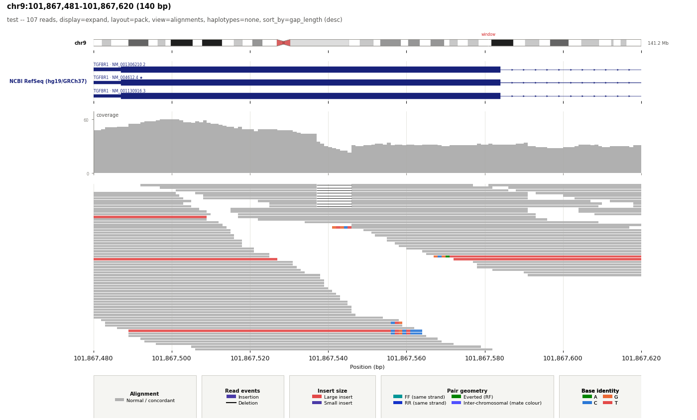

# simple_bam_snap

Create an IGV-like image from an indexed BAM without opening a genome browser.

## Get an image in 60 seconds

```bash
git clone https://github.com/GENCARDIO/simple_bam_snap.git
cd simple_bam_snap
pip3 install -r requirements.txt

python3 simple_bam_snap.py \
  --bam sample.bam \
  --region chr9:101867481-101867620 \
  --output_dir out \
  --output_name locus
```

The result is `out/locus.png`.

The BAM must be indexed. If it is not:

```bash
samtools index sample.bam
```

Regions are **1-based and inclusive**. Add `--flank 500` to show 500 bp on
each side.

For human BAMs, the first run may download and index the matching NCBI RefSeq
gene annotation. Use `--refseq none` if you want the image immediately without
that track.

## What you get by default

- chromosome ideogram with the current window marked in red;
- RefSeq isoforms for recognized hg19/GRCh37 and hg38/GRCh38 BAMs;
- coverage and packed read alignments;
- automatic alignment downsampling above 100× depth;
- discordant-pair, indel, mismatch, and soft-clip colours;
- borderless reads and a compartmented legend;
- genomic coordinates in bp, kb, Mb, or Gb—never exponent notation.

Add `--fasta reference.fa` to enable reference bases, mismatch detection, and
SNV allele fractions in coverage. A missing FASTA index is created when
possible.

## Pick the view you need

| Goal | Add these options |
|---|---|
| Normal IGV-like view | `--display_mode expand --layout pack` |
| Very deep region | `--display_mode squish --layout pack` |
| Overlay everything | `--display_mode collapse` |
| One sorted read per row | `--layout expand --sort_by gap_length` |
| Link visible mates | `--view_as_pairs` |
| Two loci: region + inferred mate locus | `--mate_view` |
| Only event-supporting reads | `--only discordant gapped split softclip` |
| Hide coverage | `--no_coverage` |
| Hide chromosome overview | `--no_ideogram` |
| Add a center guide | `--center_guide` |

`display_mode` controls read height. `layout` controls row placement. They are
independent.

## Common recipes

### Small window with reference bases

Reference bases are shown automatically for windows up to 250 bp.

```bash
python3 simple_bam_snap.py \
  --bam sample.bam \
  --fasta reference.fa \
  --region chr1:100001-100140 \
  --output_name base-detail
```

Change the limit with `--max_reference_span BP`; use `0` to hide the reference
row while keeping FASTA-backed mismatch detection.

### High-depth region

```bash
python3 simple_bam_snap.py \
  --bam deep.bam \
  --region chr1:100000-110000 \
  --display_mode squish \
  --layout pack \
  --max_alignment_depth 100 \
  --output_name deep-region
```

Coverage still uses all filtered reads. Only the displayed alignment track is
downsampled. Use `--max_alignment_depth 0` to disable downsampling or
`--max_rows N` to impose a hard row limit.

### View paired alignments

```bash
python3 simple_bam_snap.py \
  --bam sample.bam \
  --region chr9:101867481-101867620 \
  --view_as_pairs \
  --display_mode squish \
  --output_name paired-reads
```

Visible primary mates share a row and are connected. Off-window,
inter-chromosomal, supplementary, and incomplete pairs remain individual
alignments.

### Two-panel breakpoint or translocation view

```bash
python3 simple_bam_snap.py \
  --bam tumour.bam \
  --region chr3:187721000-187721500 \
  --mate_view \
  --mate_window_source discordant \
  --only discordant \
  --output_name breakpoint
```

`--mate_window_source` accepts:

- `discordant`: mapped mate positions from discordant pairs;
- `split`: supplementary positions from SA tags;
- `softclip`: mapped mates of soft-clipped reads.

Candidates are grouped by chromosome. The busiest chromosome is selected and
the panel is centered on the mean candidate position. Set its width with
`--mate_window_size BP`. Mate view currently accepts one BAM.

### Sort reads carrying an SNV

```bash
python3 simple_bam_snap.py \
  --bam sample.bam \
  --fasta reference.fa \
  --region chr9:101867520-101867570 \
  --layout expand \
  --sort_by base \
  --sort_base_position 101867542 \
  --output_name snv-sort
```

Alternative A/C/G/T alleles are placed first, followed by the reference,
deletions, skips, and reads that do not cover the position. Without a FASTA,
the most frequent observed base is used as the local reference.

### Show SNV allele fractions in coverage

```bash
python3 simple_bam_snap.py \
  --bam sample.bam \
  --fasta reference.fa \
  --region chr1:100001-100140 \
  --coverage_vaf_threshold 0.10 \
  --min_baseq 20 \
  --min_variant_mapq 20 \
  --show_variant_counts \
  --output_name vaf
```

The default threshold is VAF > 0.20. Only SNVs are included. Labels show
ALT/depth, VAF, strand counts, mean base quality, and mean MAPQ when there is
enough room.

### Haplotype-aware view

```bash
python3 simple_bam_snap.py \
  --bam phased.bam \
  --region chr1:100001-100500 \
  --haplotype_view split \
  --haplotype_filter 1 2 untagged \
  --output_name haplotypes
```

`color` colours reads by the `HP` tag. `split` also creates HP lanes and shows
phase-set information from `PS`. Override the tags with `--haplotype_tag` and
`--phase_set_tag`.

### RNA-seq sashimi view

```bash
python3 simple_bam_snap.py \
  --bam rnaseq.bam \
  --region chr1:100000-110000 \
  --sashimi \
  --min_junction_reads 3 \
  --sashimi_strand split \
  --display_mode squish \
  --output_name sashimi
```

Junctions come from CIGAR `N` operations. Arc labels are supporting-read
counts. `combined` merges strands; `split` mirrors plus and minus junctions.

### Stack several BAMs and matched VCFs

```bash
python3 simple_bam_snap.py \
  --bam tumour.bam \
  --bam normal.bam \
  --bam relapse.bam \
  --sample_label Tumour \
  --sample_label Normal \
  --sample_label Relapse \
  --vcf_companion tumour.vcf.gz \
  --vcf_companion none \
  --vcf_companion relapse.vcf.gz \
  --region chr9:101867492-101867612 \
  --output_name multi-sample
```

Repeat labels and companion VCFs in BAM order. Use `none` when a sample has no
VCF. Each BAM keeps its own coverage, alignments, downsampling, and summary.

## Add genomic tracks

The short form is enough when the filename identifies the format:

```bash
python3 simple_bam_snap.py \
  --bam sample.bam \
  --region chr9:101867492-101867612 \
  --track genes.gtf.gz \
  --track variants.vcf.gz \
  --track_label Genes \
  --track_label Variants \
  --output_name annotated
```

For full control, use one quoted CSV value per track:

```text
--custom_track 'FILE,TYPE,NAME,COLOR[,DISPLAY[,HEIGHT_IN]]'
```

Example:

```bash
--custom_track 'regions.bed,bed,Candidates,#000000,collapse,0.30' \
--custom_track 'genes.gtf.gz,gtf,GENCODE,#17217a,expand,0.85' \
--custom_track 'variants.vcf.gz,vcf,Variants,#7a1f5c,collapse,0.25'
```

Quote the entire value so `#` is not treated as a shell comment.

### Supported tracks

| Type | Use for | Default rendering |
|---|---|---|
| BED/BED12 | regions, probes, custom features | black blocks |
| GFF/GFF3/GTF | genes and transcripts | UCSC navy exon/UTR models |
| VCF | SNVs and structural variants | burgundy variant intervals |
| narrowPeak/broadPeak | ChIP-seq, ATAC-seq, DNase-seq | filled signal peaks |
| signal | non-negative four-column signal | filled signal from zero |
| SEG | segmented copy number | gain/loss log2 track |
| bedGraph/log2/CNV | binned or segmented log2 ratios | signed zero-centered track |

The accepted custom `TYPE` values are `bed`, `gff`, `gff3`, `gtf`, `vcf`,
`narrowpeak`, `broadpeak`, `peak`, `signal`, `seg`, `bedgraph`, `log2`, `cnv`,
and `auto`.

Use `--track_display` to control annotation density:

| Mode | Result |
|---|---|
| `collapse` | merge transcript isoforms into one model per gene |
| `pack` | preserve models and share non-overlapping rows |
| `expand` | one transcript per row |
| `density` | compact binned feature count |

Gene introns carry strand arrows: right for `+`, left for `-`. Exons are thick;
UTRs are thinner. Use `--primary_isoforms prefer` to select MANE Select,
RefSeq Select, Ensembl canonical, APPRIS principal, or another recognized
primary marker, while keeping all isoforms for genes without a marker. Use
`only` to remove genes without a primary marker; `all` is the default.

### Compressed tracks must be indexed

Plain-text tracks work directly. A `.gz`, `.bgz`, or `.bgzf` track must be
BGZF-compressed and have a `.tbi` or `.csi` index. It is fetched by region with
tabix; ordinary gzip is not enough.

```bash
bgzip genes.gtf
tabix -p gff genes.gtf.gz

bgzip regions.bed
tabix -p bed regions.bed.gz

bgzip variants.vcf
tabix -p vcf variants.vcf.gz

bgzip H3K27ac.narrowPeak
tabix -p bed H3K27ac.narrowPeak.gz
```

### ChIP-seq and accessibility

```bash
python3 simple_bam_snap.py \
  --bam sample.bam \
  --region chr1:100000-140000 \
  --track H3K27ac.narrowPeak.gz \
  --track_label H3K27ac \
  --custom_track 'H3K27me3.broadPeak,broadpeak,H3K27me3,#d95f02,collapse' \
  --custom_track 'DNase.narrowPeak.gz,narrowpeak,DNase,#2166ac,density' \
  --output_name chromatin
```

Peak height uses `signalValue`, then BED score. NarrowPeak summits are marked.
Use `density` when intervals would otherwise overplot.

### Copy number, BAF, and LOH

```bash
python3 simple_bam_snap.py \
  --bam tumour.bam \
  --region chr9:101000000-102000000 \
  --track tumour.seg \
  --track_label 'Tumour CNV' \
  --baf_vcf germline-snps.vcf.gz \
  --baf_sample Tumour \
  --baf_track_label 'Tumour BAF / LOH' \
  --output_name cnv-baf
```

BAF uses heterozygous biallelic SNVs. It prefers `FORMAT/AD` and falls back to
`FORMAT/AF`. Compressed VCF/BCF files require an index.

## Human references and ideograms

`--genome auto` identifies hg19 or hg38 only from exact chromosome lengths in
the BAM header. The ideogram uses bundled UCSC cytobands and spans the same
width as the genomic plot.

Useful controls:

```text
--genome hg19|grch37|hg38|grch38|none
--cytoband_file custom.cytoBand.txt.gz
--no_ideogram
```

`--refseq auto` similarly selects and caches an indexed NCBI RefSeq track.

```text
--refseq hg19|grch37|hg38|grch38|none
--refseq_dir /shared/refseq-cache
```

Pre-download both supported assemblies with:

```bash
python3 download_refseq.py
```

The fixed sources are NCBI Annotation Release 105.20220307 for
[GRCh37.p13](https://ftp.ncbi.nlm.nih.gov/genomes/all/annotation_releases/9606/105.20220307/GCF_000001405.25_GRCh37.p13/GCF_000001405.25_GRCh37.p13_genomic.gff.gz)
and Annotation Release 110 for
[GRCh38.p14](https://ftp.ncbi.nlm.nih.gov/genomes/all/annotation_releases/9606/110/GCF_000001405.40_GRCh38.p14/GCF_000001405.40_GRCh38.p14_genomic.gff.gz).

## Configure everything with YAML

Pass `--config FILE.yaml`. Command-line options override YAML preferences.

```yaml
preferences:
  display_mode: squish
  max_alignment_depth: 150
  primary_isoforms: prefer
  fig_width: 16
  dpi: 200

alignment_colors:
  normal: "#c8c8c8"
  large_insert: "#d73027"
  small_insert: "#4a3aa7"

track_colors:
  bed: "#000000"
  gene: "#17217a"
  vcf: "#7a1f5c"

styles:
  row_height_in: 0.06
  squish_row_height_in: 0.015
  coverage_track_height_in: 1.40
  annotation_row_height_in: 0.30
  alignment_edge_width: 0.00
  gene_arrow_size: 2.70
  gene_arrow_spacing_px: 24.0
```

See [config.example.yaml](config.example.yaml) for every colour, preference,
height, opacity, line width, legend setting, ideogram colour, and sashimi style.
Unknown keys and invalid values fail early.

Every track height is configurable:

| Track | YAML key |
|---|---|
| Alignments | `row_height_in`, `squish_row_height_in` |
| Coverage | `coverage_track_height_in` |
| BED/GFF/GTF/VCF | `annotation_row_height_in` |
| CNV | `cnv_track_height_in` |
| BAF/LOH | `baf_track_height_in` |
| Peaks/signal/density | `peak_track_height_in` |
| Sashimi | `sashimi_track_height_in` |
| Reference bases | `reference_height_in` |
| Ideogram | `ideogram_height_in` |

The sixth `--custom_track` CSV field overrides the height for one track.

## Output format and resolution

PNG is the default. Use a filename extension or `--output_format`:

```bash
# Editable vector image
python3 simple_bam_snap.py \
  --bam sample.bam --region chr1:100000-101000 \
  --output_name locus.svg

# High-resolution PNG
python3 simple_bam_snap.py \
  --bam sample.bam --region chr1:100000-101000 \
  --output_name locus --output_format png --fig_width 16 --dpi 300
```

Supported formats: PNG, SVG, SVGZ, PDF, JPEG, TIFF, and WebP. Raster width is
`fig_width × dpi`; height adapts to the tracks and read rows.

## Read colours and evidence

| Read appearance | Meaning |
|---|---|
| grey | normal/concordant |
| red | unexpectedly large FR insert |
| purple | unexpectedly small FR insert; also used for CIGAR insertions |
| light/medium blue | FF/RR same-strand pair |
| green | everted RF pair |
| chromosome-specific colour | inter-chromosomal mate |
| lighter fill | lower MAPQ |

The expected insert-size range is estimated from eligible FR pairs in the
window. Disable pair colours with `--no_pair_colors`; disable MAPQ shading with
`--no_mapq_shading`.

CIGAR insertion and deletion lengths are hidden by default. Show them with
`--show_indel_lengths`.

## Options people use most

| Option | Purpose |
|---|---|
| `--bam BAM` | indexed input; repeat for multiple samples |
| `--region chr:start-end` | 1-based inclusive window |
| `--fasta FASTA` | reference bases, mismatches, and coverage VAF |
| `--flank BP` | add context on both sides |
| `--display_mode collapse\|expand\|squish` | read-track density |
| `--layout pack\|expand` | packed rows or one sorted unit per row |
| `--sort_by KEY` | `base`, `gap_length`, `mapq`, `start`, and more |
| `--only TYPE [...]` | keep discordant, gapped, split, or soft-clipped reads |
| `--min_mapq N` | filter low-MAPQ reads |
| `--max_alignment_depth N` | downsample displayed reads above N×; default 100 |
| `--view_as_pairs` | link visible primary mates |
| `--mate_view` | add an inferred mate-locus panel |
| `--track PATH` | add a genomic track; repeatable |
| `--custom_track SPEC` | add a named, coloured, sized track |
| `--config YAML` | reusable defaults and styles |
| `--metrics_tsv PATH` | export per-read classifications and metrics |
| `--fig_width INCHES --dpi N` | output size and raster resolution |

Run this for the full option list:

```bash
python3 simple_bam_snap.py --help
```

## Performance: what happens on large windows

- Coverage is binned to the physical image width. Wide windows do not create
  one plotting object per base.
- Alignment display is downsampled above 100× by default. Coverage, summaries,
  sashimi counts, and TSV metrics still use the complete filtered cohort.
- Indexed tracks are fetched only for the requested region.
- Alternative alleles and discordant/gapped/split/soft-clipped evidence are
  prioritized during downsampling.

For a faster, smaller deep-region image, start with:

```text
--display_mode squish --layout pack --max_alignment_depth 100
```

Add `--max_rows 200` if the image is still too tall. Add `--only` when you need
event evidence rather than every read.

## Troubleshooting

### “The BAM has no index”

```bash
samtools index sample.bam
```

### A compressed track will not load

It must be BGZF, not ordinary gzip, and it needs `.tbi` or `.csi` beside it.
Recompress and index it with `bgzip` and `tabix`.

### Reference bases or mismatches are missing

Pass `--fasta reference.fa`. Check that FASTA and BAM chromosome names match
(`chr1` versus `1`) and that the window is no larger than
`--max_reference_span` for the visible base row.

### The automatic gene track is missing

Assembly detection requires exact hg19/GRCh37 or hg38/GRCh38 chromosome
lengths. Select explicitly with `--refseq hg19` or `--refseq hg38`. The first
download also needs network access. Use `--refseq none` to disable it.

### The image is too tall or uses too much memory

Use `--display_mode squish`, keep the default 100× downsampling, and set
`--max_rows`. For a targeted review, add `--only discordant gapped split
softclip`.

### Mate view cannot find a locus

Try another `--mate_window_source`, lower `--min_softclip`, or remove an
overly restrictive `--only` filter.

## Examples

Start with these rendered examples:

- [default RefSeq isoforms](out/30_default_refseq_isoforms.png)
- [true squish layout](out/02_squish_packed.png)
- [paired alignments](out/15_view_as_pairs.png)
- [two-locus mate view](out/06_mate_view_discordant.png)
- [SNV VAF in coverage](out/16_coverage_snv_vaf.png)
- [haplotype split view](out/19_haplotype_split_view.png)
- [RNA-seq sashimi](out/24_rnaseq_sashimi.png)
- [ChIP-seq and density](out/26_chipseq_peaks_density.png)
- [multi-BAM with companion VCFs](out/27_multi_bam_vcf_companions.png)
- [CNV with BAF/LOH](out/18_variant_evidence_baf_loh.png)
- [SVG output](out/25_vector_output.svg)



## Tests

```bash
pytest -q
```
