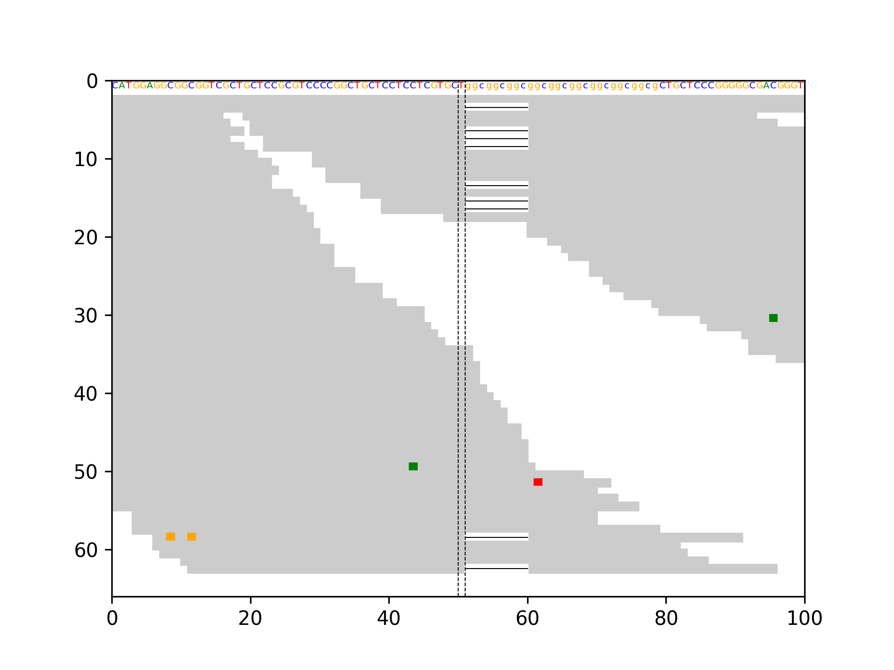

# simple_bam_snap
 Simple python script that creates genomic snapshots (igv-like) based on samtools tview functionality

## Download and Install
```
 git clone --recursive https://github.com/GENCARDIO/simple_bam_snap.git
 cd simple_bam_snap
 pip3 install -r requirements.txt
 
 Note: it is required a genome file in FASTA format.

```
## Command Example
```
 python3 simple_bam_snap.py --bam test/test.bam --region chr9:101867537-101867537 --fasta ~/Desktop/reference/ucsc.hg19.fasta --output_dir test

```
## Example output

